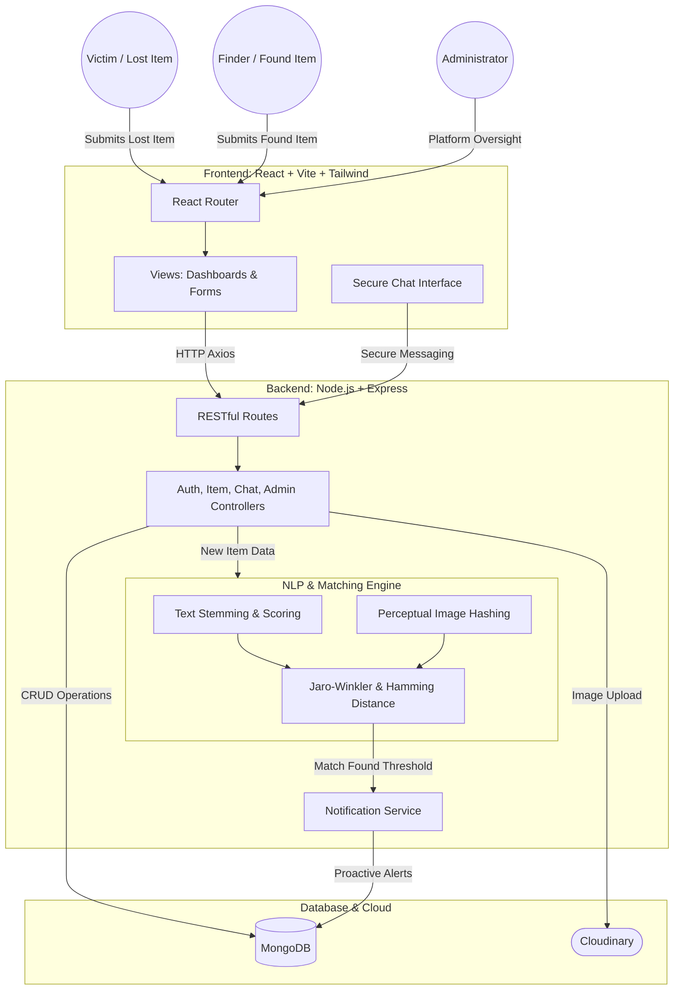

# CampusFix

## Overview
CampusFix is an intelligent, full-stack Lost and Found system tailored for campus and community environments. Moving beyond traditional bulletin board style applications, CampusFix features an automated matching engine that proactively links users who have lost items with those who have found them, utilizing Natural Language Processing (NLP) and perceptual image hashing.

## Key Modules

The system is divided into six core modules designed to maximize recovery rates while prioritizing user privacy and security.

### 1. Lost Item Module
When a user loses an item, the system guides them through a streamlined reporting process. Users submit detailed information including title, category, location, date, description, and an optional image. Listings can be made public (visible on the community feed) or private (relying entirely on the NLP matching engine). The backend processes text data and calculates a perceptual image hash for uploaded images. The system immediately scans all active found items and, upon meeting a match threshold, notifies both parties and establishes a secure chat connection.

### 2. Found Item Module
To prevent fraudulent claims, the found item workflow is highly restricted. Finders submit details of the discovered item, and the backend defaults all found items to private visibility to prevent them from appearing on public feeds. The NLP engine performs a reverse match against all active lost items. When a match is detected, the system alerts both parties and opens a chat where the finder can verify ownership through identifying questions before physically returning the item.

### 3. Administration and Moderation Module
Administrators (such as campus security) are equipped with a dashboard to oversee platform health. Admins can view all items regardless of visibility, archive or delete fraudulent listings, and manage the user registry. This module includes tools to instantly block malicious users, which cascades to close all their active secure chats. Admins can also trigger background archival jobs and monitor real-time system analytics.

### 4. NLP and Image Matching Engine Module
The core of CampusFix is its specialized matching engine. For text-based scoring, it tokenizes and stems strings, removing stop words, and utilizes Jaro-Winkler distance to forgive typos and fuzzy spatial matches. For visual matching, images are processed through an image hashing algorithm to generate a 64-bit Hex hash. The system calculates the Hamming Distance between hashes to determine visual similarity efficiently. The engine dynamically weights signals, lowering the overall match threshold when strong visual matches are present.

### 5. Secure Communication Module
The chat architecture maintains strict privacy between matched users. A chat document requires references to the specific lost item, found item, and exactly two participants. This secure channel allows users to communicate and verify ownership safely without exchanging personal contact information initially. 

### 6. Notification and Alert Module
The notification system proactively triggers internal alerts for potential matches generated by the NLP engine and system updates on the status of reported items. This ensures users do not need to constantly monitor the platform for updates.

## Deep Architectural Overview

### System Architecture Flow



### Database Schema and Indexing
The application utilizes MongoDB with compound indices on item type, status, and category for efficient filtering. A text index on the title and description enables rapid full-text search. The schema relies on ObjectId references to link Users, Items, and Chats, ensuring relational data integrity within a NoSQL structure.

## Technology Stack

### Frontend
- Framework: React 18 with Vite
- Styling: Tailwind CSS
- State and Routing: react-router-dom
- HTTP Client: Axios
- Animations: Framer Motion

### Backend
- Runtime: Node.js with Express.js
- Database: MongoDB configured with Mongoose
- Authentication: Stateless JWT architecture
- Media Handling: Cloudinary paired with Multer for secure cloud storage
- NLP Toolkit: Natural library for stemming and Jaro-Winkler calculations

## Project Structure

The repository is divided into two main environments:

**Backend (/backend)**
- /controllers: Core business logic
- /models: Mongoose schemas
- /routes: Express routers mapping to controllers
- /utils: Houses the matching engine and archival job scripts

**Frontend (/src)**
- /pages: Full-page views
- /components: Reusable UI blocks
- /context: React Context providers

## API Endpoint Reference

- Auth Routes (/api/auth): Registration, Login, Profile Management.
- Item Routes (/api/items): Submit lost/found items, query items, edit textual details.
- Chat Routes (/api/chat): Fetch active conversations, send messages securely.
- Notification Routes (/api/notifications): Retrieve and mark system alerts as read.
- Admin Routes (/api/admin): System oversight, global item modification, user blocking, and stats gathering.

## Development Guide

### Prerequisites
- Node.js (v16+)
- MongoDB Atlas cluster (or local instance)
- Cloudinary Account

### Installation

Clone the repository and install dependencies:

```bash
git clone https://github.com/aditya-mayank/CampusFix.git
cd CampusFix

# Install Backend
cd backend
npm install

# Install Frontend
cd ../src
npm install
```

### Environment Configuration

Navigate to the backend directory and create a .env file:

```env
PORT=5000
MONGO_URI=your_mongodb_connection_string
JWT_SECRET=your_highly_secure_jwt_secret
CLOUDINARY_CLOUD_NAME=your_cloudinary_cloud_name
CLOUDINARY_API_KEY=your_cloudinary_api_key
CLOUDINARY_API_SECRET=your_cloudinary_api_secret
```

### Running the Application Locally

Run the frontend and backend servers concurrently.

**Backend Terminal:**
```bash
cd backend
npm start
```

**Frontend Terminal:**
```bash
cd src
npm run dev
```

## Contributing and License
Contributions, issues, and feature requests are highly encouraged.